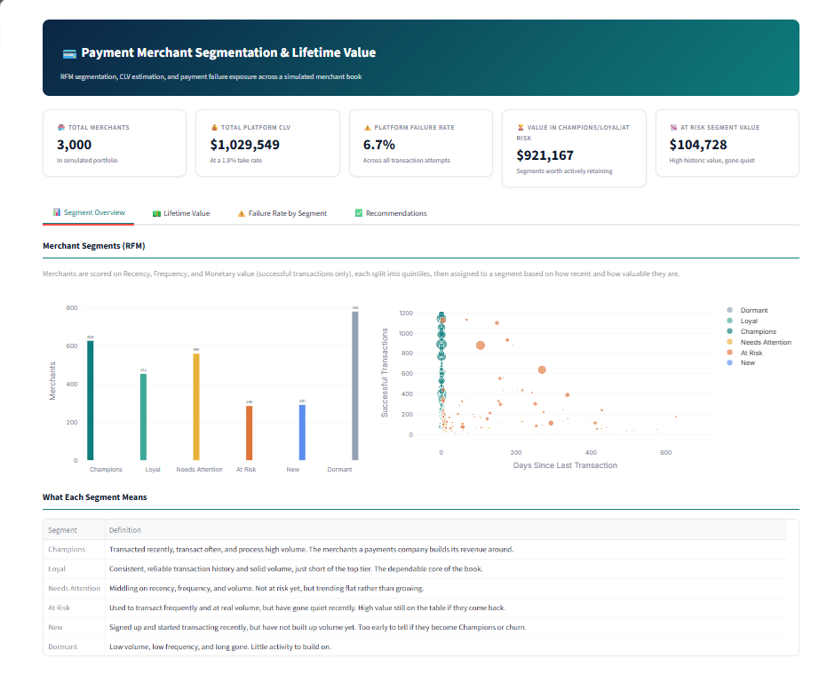

# Payment Merchant Segmentation and Lifetime Value

A merchant analytics project built for a payments company context. It segments merchants by
transaction behavior, estimates how much each merchant is worth to the platform, and identifies
where payment failures are putting the most value at risk.

## The business question

A payments platform processes transactions for thousands of merchants, but not all merchants are
worth the same to the business. Some are high volume and reliable. Some used to be valuable and
have gone quiet. Some are new and unproven. Treating them all the same wastes effort: retention
outreach aimed at a merchant worth $40 in lifetime value is not the same decision as outreach
aimed at one worth $4,000.

On top of that, payment failures are not evenly distributed. A platform that only tracks its
overall decline rate can miss that a chunk of its most valuable merchants sit behind a failure
rate worse than average, quietly losing revenue and patience with every declined charge.

This project answers three questions with the same dataset:

1. Which merchants matter most, and which are already drifting away?
2. What is each merchant actually worth to the platform, not just how much money they move?
3. Where should a product team spend its limited attention first?

## The data

The dataset is simulated, not scraped or real merchant data, so it is safe to publish and fully
reproducible. `generate_data.py` builds 3,000 merchants and roughly 575,000 transactions spread
across 24 months. The generator is seeded, so running it twice produces the same numbers.

A few things were built in deliberately because they show up in real payments portfolios:

- **Transaction size follows a long tail.** Most merchants process small tickets. A minority
  process much larger ones, and that minority accounts for a disproportionate share of volume.
- **Decline rates vary by merchant and by industry.** Subscription and digital goods businesses
  run hotter decline rates than food and beverage or professional services, which mirrors real
  card-not-present risk patterns.
- **A share of merchants churn partway through the window.** Recency is not hardcoded into the
  data. It falls out naturally from merchants who stop transacting, which is what lets the
  segmentation below mean something.

## Method

### RFM segmentation

Each merchant gets scored on Recency (days since their last successful transaction), Frequency
(count of successful transactions), and Monetary value (total successful transaction value).
Failed transactions are excluded from F and M on purpose. A declined charge is not revenue, and
letting it inflate a merchant's score would hide the exact problem this project is trying to find.

Each of the three measures is split into quintiles, and the scores combine into six segments:
Champions, Loyal, Needs Attention, At Risk, New, and Dormant. The segment names and cutoffs
follow the standard published RFM segment map, which keeps the method easy to defend rather than
inventing a custom scoring scheme.

### Lifetime value

A payments company does not earn a merchant's full transaction volume. It earns a cut of it. So
every CLV figure in this project is platform revenue, not merchant GMV: transaction volume
multiplied by an assumed 1.8% net take rate, a reasonable stand-in for a blended rate after
interchange and scheme fees.

CLV has two parts:

- **Historic value**, which is simply the platform revenue already earned from that merchant.
  Observed, not modeled.
- **Predicted future value**, which only applies to merchants who are still active (a transaction
  within the last 60 days). It comes from a logistic regression that predicts whether a merchant
  is currently churned, trained on behavioral features like frequency, average ticket size,
  decline rate, tenure, and industry. Recency itself is deliberately excluded from the model
  since it is what defines the churn label, and including it would make the prediction circular.
  The model scores 0.80 AUC on held-out merchants.

  From each active merchant's predicted churn probability, expected remaining lifetime is
  estimated with `1 / monthly churn probability`, the standard relationship between a constant
  monthly churn hazard and expected customer lifetime, capped at 60 months so a near-zero churn
  probability does not produce an unrealistic number.

Merchants who already look churned get zero predicted future value. Projecting a dead merchant's
past run-rate forward would overstate what they are worth going forward.

### Failure exposure

Failure rate is measured across every transaction attempt, successes and failures both, which is
the standard definition of decline rate in payments. The key metric here is value-weighted
failure exposure: total segment CLV multiplied by that segment's failure rate. A segment can have
a high raw exposure number just because it is large, even if its failure rate is unremarkable, so
the recommendation logic only flags segments whose failure rate is actually above the platform
average.

## Key findings

Numbers below come from one run of the seeded generator, so they will match anyone else running
the same code.

- The platform-wide failure rate is 6.7% across roughly 575,000 transaction attempts.
- Champions (628 merchants) hold an average CLV of about $1,026, versus about $45 for Dormant
  merchants (782 merchants). The value gap between the top and bottom segment is over 20x.
- Loyal merchants show a failure rate of 7.0%, above the 6.7% platform average, and together
  account for $12,000 of value-weighted failure exposure, the highest among segments actually
  failing above average.
- At Risk merchants (285 merchants, $104,728 in total lifetime value) have gone quiet for 76 days
  on average despite a strong transaction history, and their failure rate of 7.2% is also above
  the platform average. That is consistent with payment friction being part of why they stopped
  transacting, not proof of it, but a strong enough pattern to act on.

## What I would recommend

**1. Fix payment failures in the Loyal segment first.** It is the highest-value segment whose
failure rate sits meaningfully above the platform average. Retry logic, expired card detection,
and smarter processor routing would protect more revenue here per point of improvement than the
same fix applied to a smaller or lower-value segment.

**2. Treat At Risk as a churn-prevention priority, not a segment to passively monitor.** These
merchants already carry real historic value and are already showing the drop-off pattern of
churn in progress. Because their failure rate is also elevated, a direct win-back outreach paired
with a payment-reliability fix is a stronger move than outreach alone, before they fully cool
into Dormant.

## Dashboard

The Streamlit app has four views: a segment overview with the RFM breakdown, a CLV distribution
view, a segment-by-failure-rate view with the value-weighted exposure chart, and a
recommendations panel that explains exactly how each recommendation was generated from the data
above it.



## Assumptions worth arguing with

- **1.8% take rate.** A real business should replace this with its actual blended net take rate.
- **60-day churn threshold.** Chosen because 60 days of silence from a previously transacting
  merchant is a strong, standard signal, not because it is the only reasonable cutoff.
- **Constant monthly churn hazard.** The `1 / churn rate` lifetime estimate assumes a merchant's
  monthly risk of churning stays flat over time. Real churn risk usually is not flat, it often
  rises the longer a merchant goes without transacting, so this is a simplification, not a
  guarantee.
- **RFM on the full 24-month window.** No rolling window was used, so a merchant's frequency and
  monetary scores reflect their entire history on the platform, not just recent months.

## Tech stack

Python, pandas, NumPy, scikit-learn, Plotly, Streamlit.

## Project structure

```
payment-merchant-clv-segmentation/
  generate_data.py        # simulates merchants.csv and transactions.csv
  analysis/
    data_loader.py         # loads and types the CSVs
    rfm.py                 # recency, frequency, monetary scoring and segmentation
    clv.py                 # take-rate revenue, churn model, predicted lifetime value
    insights.py             # segment x failure rate summary and recommendation logic
  app.py                   # Streamlit dashboard
  data/                     # generated CSVs, committed so the app runs without a setup step
  screenshots/
```

## Quickstart

```bash
pip install -r requirements.txt
python generate_data.py      # writes merchants.csv and transactions.csv to data/
streamlit run app.py
```

Then open http://localhost:8501.
